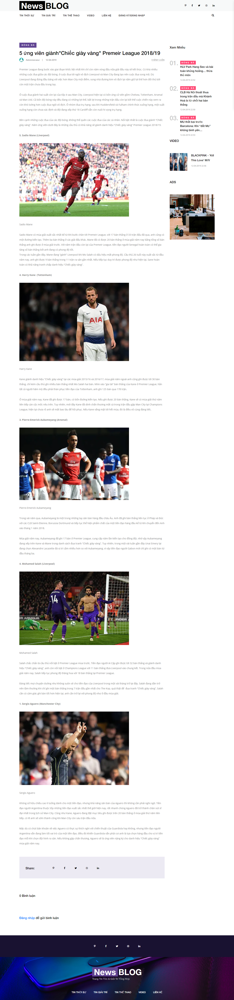
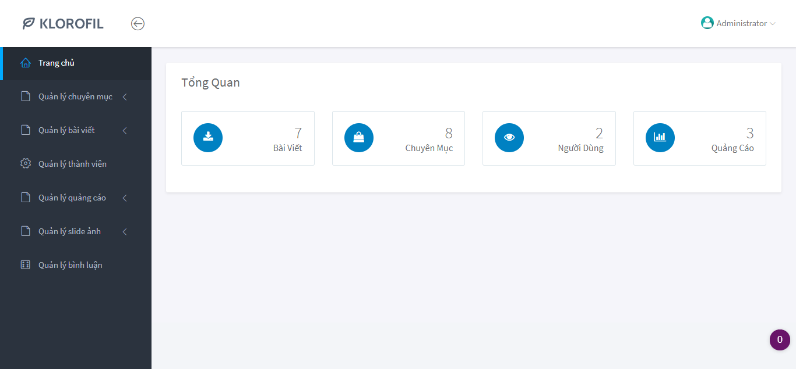

# Blog Tin Tức Laravel  
## Hướng dẫn cài đặt
1. Clone Repo
2. Rename env.example -> .env
3. Sửa kết nối tới database
4. Chạy composer
5. Chạy Migrate, Seeder hoặc import file laravel_news.sql  

## Demo  

